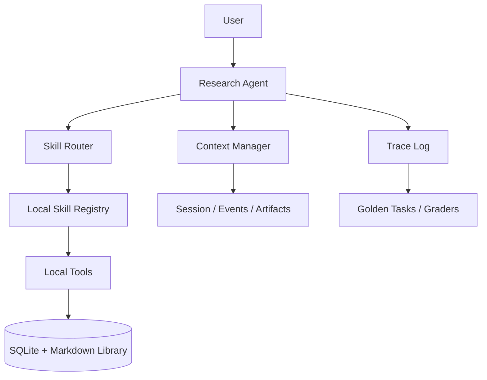
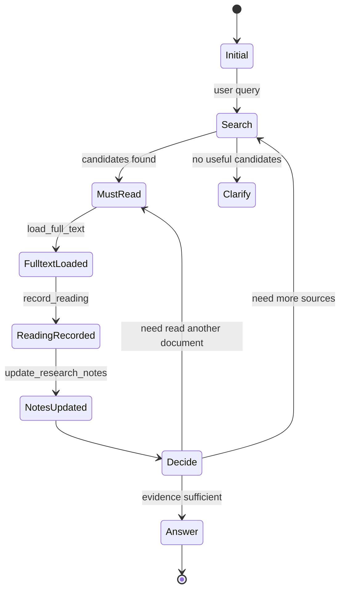

# MyLibPro Skills-first Agent 设计规范

## 版本定位

本文是在原《面向 2026 Skills-first Agent 平台的开发规范草案》基础上的可落地修订版。它只采纳对 MyLibPro 当前阶段有直接价值的现代 Agent 范式：Skills、结构化状态、可追踪事件、上下文管理、回归评估与安全边界。

本文明确不引入 MCP 和 A2A。当前系统仍保持单核心 Agent、本地函数工具、本地全文 Markdown 图书馆与内置工作区。所有架构演进都必须服务于一个目标：让 Agent 更稳定、更可审计地逐篇阅读全文 Markdown，并把最有价值的全文材料自动装载到当前上下文。

## 不可改变的核心原则

### 1. 全文 Markdown 是一级知识源

系统的知识基础不是摘要、向量切片、metadata 或搜索片段，而是每篇文献对应的完整 Markdown 全文。搜索、筛选、排序、摘要、笔记和引用都只能作为进入全文阅读的辅助机制，不能替代全文阅读。

工程约束：

- 每篇文献必须尽可能维护 `full_text_path`。
- `load_full_text` 必须返回完整 Markdown，或在文档过大时返回完整章节序列。
- 搜索结果不能作为深度回答的唯一依据。
- Agent 生成研究性结论前，必须至少完成一次全文读取或章节级完整读取。

### 2. Agent 必须能逐篇阅读全文 Markdown

Agent 的核心能力不是“检索相关片段”，而是“选择一篇文献，阅读全文，记录发现，再决定是否继续读下一篇”。这个行为应由运行时状态机和 Skill 契约共同保证。

工程约束：

- 深度研究任务必须遵循 `search -> load_full_text -> record_reading -> update_research_notes -> answer_or_continue`。
- `record_reading` 必须绑定具体 `document_id`。
- `update_research_notes` 必须基于已经读取的全文内容。
- 最终回答必须能追溯到已读取文献。

### 3. 当前上下文自动保留最有用的 Markdown

Active References 不是简单列表，而是当前上下文的全文装载区。Agent 应主动判断哪些全文对当前问题最有用，并将其保留在上下文中。上下文不足时，可以移出低价值全文，但必须保留阅读记录、证据摘要和可重新加载路径。

工程约束：

- `activeReferences` 表示当前上下文中优先保留的全文材料。
- `readingHistory` 记录已经完整阅读过但可能不再常驻上下文的文献。
- `researchNotebook` 保存跨文献推理、比较和未决问题。
- `remove_reference` 只能释放上下文，不能删除文献、笔记或阅读历史。

## 设计目标

本设计不是把 MyLibPro 改造成通用 Agent 平台，而是把现有 Agent 的研究流程 skills 化。

目标包括：

- 把隐含在 system prompt 里的研究流程拆成可版本化 Skills。
- 让每个 Skill 有明确输入、输出、能力边界和失败策略。
- 保留当前本地函数工具，不引入 MCP/A2A。
- 把工作区升级为 Session + Event + Artifact 模型。
- 用 trace 和 golden tasks 验证 Agent 是否真的读取了全文。
- 支持后续逐步扩展，而不破坏当前可运行系统。

非目标：

- 不重写为 Python 控制面。
- 不把 SQLite 立即迁移到 PostgreSQL。
- 不引入远程 Agent、A2A 或跨团队协议。
- 不把全文 Markdown 替换为 embedding chunk。
- 不让 Skill 成为黑盒流程框架。

## 总体架构

推荐采用“单 Agent + Skills + 本地工具 + 结构化工作区”的架构。



核心关系：

- Agent 负责理解用户目标、选择 Skill、决定是否继续阅读。
- Skill 负责规定“怎么做”，例如如何搜索、如何阅读全文、如何做笔记。
- Tool 负责具体执行，例如查 SQLite、读取 Markdown、更新工作区。
- Context Manager 负责当前上下文中保留哪些全文。
- Workspace 负责保存当前任务的全部状态和可回放记录。

## Skill 设计原则

### Skill 是流程知识，不是工具

工具回答”能做什么”，Skill 回答”应该如何做”。

例子：

- `search_library` 是工具。
- `research.find_seed_documents` 是 Skill。
- `load_full_text` 是工具。
- `research.read_fulltext_and_note` 是 Skill。

### Skill 不替代 Agent 判断

Skill 不应该变成硬编码脚本，把 Agent 变成执行器。Skill 应提供流程约束、输入输出结构、质量标准和失败处理方式，具体读哪篇、是否继续查找、如何综合证据，仍由 Agent 在工具结果基础上判断。

### Skill 必须保护全文原则

任何研究类 Skill 都不能绕过全文读取直接生成深度结论。Skill 的最低合格标准是：它必须让 Agent 明确知道自己读过哪篇全文、得到什么发现、这些发现如何进入当前上下文或笔记。

### Skill 粒度权衡

Skill 粒度需要在”可组合性”和”可理解性”之间平衡：

- **粗粒度 Skill**（如 `read_fulltext_and_note`）：包含多个步骤，但语义完整，适合高层流程描述。
- **细粒度 Skill**（如 `load_fulltext` + `extract_findings`）：步骤单一，但需要更多组合逻辑。

推荐策略：

- 阶段一采用粗粒度 Skill，快速验证可行性。
- 阶段二根据实际使用情况，考虑是否拆分为细粒度 Skill。
- 在 `SKILL.md` 中明确定义 Skill 的内部子步骤，即使不拆分也能保持清晰。

## 推荐 Skill 列表

### 1. `research.find_seed_documents`

用途：从用户问题出发，检索候选文献并选择第一批值得阅读全文的文献。

输入：

```json
{
  "query": "string",
  "preferred_types": ["book", "paper"],
  "discipline": "string | optional",
  "max_candidates": 10
}
```

输出：

```json
{
  "candidate_documents": [
    {
      "document_id": "string",
      "title": "string",
      "reason_to_read": "string",
      "priority": "high | medium | low"
    }
  ],
  "next_action": "load_fulltext | refine_search | ask_user"
}
```

规则：

- 优先选择教材或综述作为理论基础。
- 搜索结果只能用于选书，不能用于最终深度回答。
- 必须给每篇候选文献写出阅读理由。

对应工具：

- `search_library`
- `get_document_detail`

### 2. `research.read_fulltext_and_note`

用途：加载并阅读全文 Markdown，记录文献级发现。

输入：

```json
{
  "document_id": "string",
  "reading_purpose": "string",
  "focus_questions": ["string"]
}
```

输出：

```json
{
  "document_id": "string",
  "read_status": "completed | partial_with_reason | failed",
  "key_findings": "string",
  "usefulness": "high | medium | low",
  "should_keep_active": true
}
```

规则：

- 必须调用 `load_full_text`。
- 必须调用 `record_reading`。
- 如果 Markdown 过长导致无法一次进入上下文，必须按章节顺序读取，不能只读搜索命中的片段。
- 必须判断该文献是否应保留在 Active References。

对应工具：

- `load_full_text`
- `record_reading`
- `remove_reference`

### 3. `research.update_notebook`

用途：把单篇阅读发现合并进跨文献研究笔记。

输入：

```json
{
  "document_id": "string",
  "key_findings": "string",
  "relation_to_question": "string",
  "conflicts_or_limits": "string | optional"
}
```

输出：

```json
{
  "notebook_update_mode": "append | replace",
  "updated_sections": ["string"],
  "open_questions": ["string"]
}
```

规则：

- 笔记不能只是摘要，必须包含对用户问题有用的判断。
- 多篇文献之间的冲突、互补和证据强弱必须显式记录。
- 笔记必须保留引用到具体 `document_id` 的能力。

对应工具：

- `update_research_notes`

### 4. `research.decide_continue_or_answer`

用途：决定继续搜索、继续阅读全文，还是生成最终回答。

输入：

```json
{
  "query": "string",
  "active_references": ["document_id"],
  "reading_history": ["document_id"],
  "research_notebook": "string"
}
```

输出：

```json
{
  "decision": "search_more | read_more | answer",
  "reason": "string",
  "needed_document_type": "book | paper | any | optional",
  "missing_evidence": ["string"]
}
```

规则：

- 如果只有搜索结果、没有全文阅读，不允许 `answer`。
- 如果已读文献无法回答关键问题，必须 `search_more` 或 `read_more`。
- 如果 Active References 太多，必须释放低相关文献。

对应工具：

- `search_library`
- `load_full_text`
- `remove_reference`

### 5. `research.compose_answer_with_citations`

用途：基于已读取全文和研究笔记生成最终回答。

输入：

```json
{
  "query": "string",
  "active_references": ["document_id"],
  "research_notebook": "string",
  "citation_style": "default | apa | chicago"
}
```

输出：

```json
{
  "answer_markdown": "string",
  "cited_documents": ["document_id"],
  "confidence": "high | medium | low",
  "limitations": ["string"]
}
```

规则：

- 引用必须来自已读取文献。
- 必须区分文献结论、Agent 综合判断和不确定性。
- 如果证据不足，必须明确说明缺口，而不是编造。

对应工具：

- 工作区快照读取
- 引用格式化逻辑

## Skill 文件结构

建议在项目中新增：

```text
skills/
  research.find_seed_documents/
    SKILL.md
    schema.json
  research.read_fulltext_and_note/
    SKILL.md
    schema.json
  research.update_notebook/
    SKILL.md
    schema.json
  research.decide_continue_or_answer/
    SKILL.md
    schema.json
  research.compose_answer_with_citations/
    SKILL.md
    schema.json
```

每个 `SKILL.md` 应包含：

- 目的
- 何时使用
- 输入契约
- 输出契约
- 必须调用的工具
- 禁止行为
- 失败处理
- 质量检查清单

示例：

```markdown
# research.read_fulltext_and_note

## Purpose
Read one complete Markdown document and record findings relevant to the user question.

## Required Tools
- load_full_text
- record_reading
- update_research_notes when findings affect the research notebook

## Must Not
- Do not answer from search snippets.
- Do not skip full text reading.
- Do not keep a document active unless it is useful to the current question.

## Completion Criteria
- Full text was loaded.
- Reading findings were recorded.
- The document was either kept active or moved to reading history with a reason.
```

## 运行时状态模型

当前工作区应从三个内存字段升级为四类状态。

### Session

表示一次研究任务。

字段建议：

```ts
interface ResearchSession {
  sessionId: string;
  userQuery: string;
  status: "active" | "waiting" | "completed" | "failed";
  createdAt: string;
  updatedAt: string;
  activeSkill?: string;
}
```

### Event

记录 Agent 的每一步关键行为。

```ts
interface ResearchEvent {
  eventId: string;
  sessionId: string;
  type:
    | "skill_selected"
    | "library_searched"
    | "fulltext_loaded"
    | "document_read"
    | "reference_activated"
    | "reference_removed"
    | "notebook_updated"
    | "answer_generated";
  documentId?: string;
  payload: Record<string, unknown>;
  createdAt: string;
}
```

**存储策略**：

- **阶段二**：Event 存储在内存中（`WorkspaceState.events: ResearchEvent[]`），随 session 生命周期管理。
- **阶段三后**：如需持久化，可考虑 SQLite 单表存储，索引 `(sessionId, createdAt)`。
- **性能优化**：Event 写入使用异步批量提交，避免阻塞工具执行。

### Artifact

保存可复用的中间成果。

```ts
interface ResearchArtifact {
  artifactId: string;
  sessionId: string;
  type: "reading_note" | "evidence_summary" | "citation_list" | "final_answer";
  title: string;
  contentMarkdown: string;
  sourceDocumentIds: string[];
  createdAt: string;
}
```

**存储策略**：

- **阶段二**：Artifact 作为 Event 的附属数据，不单独建表。
- **阶段三后**：如需独立查询（如"查看所有 reading_note"），可单独建表。

### Active Context

表示当前真正装载进上下文的全文材料。

```ts
interface ActiveReference {
  referenceId: string;
  documentId: string;
  title: string;
  tokenCount: number;
  usefulness: "high" | "medium" | "low";
  loadedAt: string;
  reasonToKeep: string;
}
```

**usefulness 评估规则**：

- **high**：是回答问题的核心理论来源，或提供关键定义/定理/方法/数据。
- **medium**：提供重要背景信息，或与其他文献存在需要比较的观点。
- **low**：只提供边缘信息，已被笔记充分吸收。

**迁移路径**：

- 阶段一：保持现有 `ActiveReference` 结构不变。
- 阶段三：增加 `usefulness` 和 `reasonToKeep` 字段，初始值均为空。
- 阶段三后：要求 Agent 在调用 `load_full_text` 后必须设置这两个字段。

## 上下文管理策略

上下文管理不能破坏全文阅读原则。

### 正确流程

1. 搜索候选文献。
2. 选择一篇文献。
3. 加载完整 Markdown。
4. Agent 阅读全文。
5. 记录阅读发现。
6. 判断是否保留全文在 Active References。
7. 如果上下文超预算，移出低价值全文，但保留阅读事件和 artifact。

### 错误流程

1. 搜索候选文献。
2. 只读摘要或命中片段。
3. 生成最终答案。

这种流程必须被测试和运行时状态机禁止。

### 自动保留规则

文献应保留在 Active References，当它满足任一条件：

- 是回答问题的核心理论来源。
- 提供关键定义、定理、方法或数据。
- 与其他文献存在需要比较的冲突观点。
- 用户明确要求围绕该文献继续分析。

文献可移出 Active References，当它满足任一条件：

- 只提供背景信息，已被笔记充分吸收。
- 与当前问题相关性低。
- 与更权威或更直接的文献重复。
- 上下文预算不足，且该文献不是最终回答的关键证据。

移出时必须记录：

- `document_id`
- 移出原因
- 已提取的关键发现
- 是否仍可能在后续重新加载

### 上下文预算管理

**阶段三实施策略**：

1. **定义预算阈值**：
   ```typescript
   const CONTEXT_BUDGET = {
     soft_limit: 100_000,  // 软限制：提示 Agent 考虑清理
     hard_limit: 150_000,  // 硬限制：强制要求清理
   };
   ```

2. **触发时机**：
   - 每次 `load_full_text` 后检查 `totalTokens`。
   - 超过 `soft_limit` 时，在工具返回中提示 Agent："上下文接近预算，建议评估 Active References 的 usefulness"。
   - 超过 `hard_limit` 时，拒绝加载新文献，要求 Agent 先调用 `remove_reference`。

3. **手动触发**（阶段三）：
   - Agent 主动调用 `remove_reference(document_id, reason)`。
   - 系统记录 `reference_removed` event。
   - 被移除文献的 reading history 和 artifact 保持不变。

4. **自动触发**（阶段四后，可选）：
   - 当超过 `hard_limit` 时，系统自动移除 `usefulness: "low"` 的文献。
   - 移除前必须征得 Agent 确认（通过工具返回提示）。
   - 记录自动移除的原因和被移除文献列表。

5. **恢复机制**：
   - 提供 `reload_reference(document_id)` 工具，允许 Agent 重新加载已移除的文献。
   - 从 reading history 中恢复 metadata，避免重新搜索。

**风险缓解**：

- 阶段三只实现手动触发，充分测试后再考虑自动化。
- 建立"误删保护"：核心文献（`usefulness: "high"`）不允许自动移除。
- 提供"上下文快照"功能，允许回滚到移除前的状态。

## Agent 状态机

推荐把当前 Agent workflow 显式化为状态机。



运行时禁止项：

- `Search -> Answer`
- `FulltextLoaded -> Answer` 且没有 `record_reading`
- `ReadingRecorded -> Answer` 且没有 `update_research_notes`
- 引用未读取文献

## 当前代码迁移建议

### 阶段一：零风险 Skill 化（预计 1-2 周）

目标：不改变现有 API 行为，只把流程配置化。

任务：

1. **创建 Skill 目录结构**：
   ```bash
   mkdir -p skills/research.find_seed_documents
   mkdir -p skills/research.read_fulltext_and_note
   mkdir -p skills/research.update_notebook
   mkdir -p skills/research.decide_continue_or_answer
   mkdir -p skills/research.compose_answer_with_citations
   ```

2. **编写 SKILL.md**：
   - 每个 Skill 一个 `SKILL.md`，包含：
     - Purpose（目的）
     - When to use（何时使用）
     - Input contract（输入契约）
     - Output contract（输出契约）
     - Required tools（必须调用的工具）
     - Must not（禁止行为）
     - Failure handling（失败处理）
     - Quality checklist（质量检查清单）
   - 参考第 340-360 行的示例格式。

3. **创建 Skill 加载器**：
   ```typescript
   // lib/skills.ts
   export interface SkillDefinition {
     name: string;
     purpose: string;
     requiredTools: string[];
     prohibitedBehaviors: string[];
     inputSchema: Record<string, unknown>;
     outputSchema: Record<string, unknown>;
   }
   
   export function loadSkill(skillName: string): SkillDefinition {
     const skillPath = path.join(process.cwd(), 'skills', skillName, 'SKILL.md');
     const content = fs.readFileSync(skillPath, 'utf-8');
     return parseSkillMarkdown(content);
   }
   
   export function getAllSkills(): SkillDefinition[] {
     // 读取 skills/ 目录下所有 Skill
   }
   ```

4. **修改 system prompt**：
   - 在 `app/api/agent/chat/route.ts` 中，将流程说明收敛为 Skill 引用。
   - 保留原有 prompt 作为注释，便于对比。
   - 示例：
     ```typescript
     const systemPrompt = `
     你是一个学术研究助手。你的工作流程由以下 Skills 定义：
     
     1. research.find_seed_documents - 检索候选文献
     2. research.read_fulltext_and_note - 阅读全文并记录
     3. research.update_notebook - 更新研究笔记
     4. research.decide_continue_or_answer - 决定继续还是回答
     5. research.compose_answer_with_citations - 生成带引用的答案
     
     详细定义见 skills/ 目录。
     
     /* 原有 prompt（保留作为参考）:
     你必须先搜索文献，然后加载全文，记录阅读发现...
     */
     `;
     ```

5. **保留现有工具和状态机**：
   - `lib/agent-tools.ts` 不变。
   - `lib/workspace.ts` 不变。
   - `app/api/agent/chat/route.ts` 的状态机逻辑不变。

验收标准：

- **行为不退化**：
  - 运行现有测试用例，确保通过率 100%。
  - 手动测试至少 3 个深度问题，确认仍会调用 `load_full_text`。
  - 对比 Skill 化前后的工具调用序列，确保一致。

- **代码质量**：
  - `npm run lint` 通过。
  - `npm run build` 成功。
  - 没有引入 MCP/A2A 相关代码。

- **文档完整**：
  - 5 个 Skill 的 `SKILL.md` 全部编写完成。
  - `lib/skills.ts` 包含完整的加载和解析逻辑。

- **回归测试**：
  - 建立 baseline：记录 Skill 化前的 3 个典型问题的完整对话日志。
  - Skill 化后重新运行相同问题，对比工具调用序列和最终答案。
  - 允许的差异：prompt 措辞变化，但工具调用顺序和参数必须一致。

### 阶段二：事件化工作区（预计 2-3 周）

目标：让每次阅读和上下文变化可追踪。

任务：

1. **扩展 WorkspaceState**：
   ```typescript
   // lib/workspace.ts
   export interface WorkspaceState {
     // 现有字段
     sessionId: string;
     activeReferences: ActiveReference[];
     readingHistory: ReadingHistoryEntry[];
     researchNotebook: string;
     totalTokens: number;
     createdAt: string;
     
     // 新增字段
     events: ResearchEvent[];
     artifacts: ResearchArtifact[];
   }
   ```

2. **在工具执行后写入 Event**：
   ```typescript
   // lib/agent-tools.ts
   export async function executeTool(
     name: string, 
     args: Record<string, unknown>, 
     sessionId: string
   ): Promise<unknown> {
     const result = await actualToolExecution(name, args);
     
     // 写入 Event（异步，不阻塞返回）
     recordEvent(sessionId, {
       type: mapToolToEventType(name),
       documentId: args.document_id as string | undefined,
       payload: { args, result },
     }).catch(err => console.error('Failed to record event:', err));
     
     return result;
   }
   
   function mapToolToEventType(toolName: string): ResearchEvent['type'] {
     const mapping: Record<string, ResearchEvent['type']> = {
       'search_library': 'library_searched',
       'load_full_text': 'fulltext_loaded',
       'record_reading': 'document_read',
       'update_research_notes': 'notebook_updated',
       'remove_reference': 'reference_removed',
     };
     return mapping[toolName] || 'skill_selected';
   }
   ```

3. **将 `record_reading` 输出同步为 `reading_note` artifact**：
   ```typescript
   // 在 record_reading 工具执行后
   const artifact: ResearchArtifact = {
     artifactId: generateId(),
     sessionId,
     type: 'reading_note',
     title: `Reading note: ${document.title}`,
     contentMarkdown: keyFindings,
     sourceDocumentIds: [documentId],
     createdAt: new Date().toISOString(),
   };
   workspace.artifacts.push(artifact);
   ```

4. **将最终回答保存为 `final_answer` artifact**：
   - 在 Agent 生成最终回答时（检测到非工具调用的文本输出），保存为 artifact。
   - 包含引用的文献列表。

5. **提供查询接口**：
   ```typescript
   // lib/workspace.ts
   export function getSessionEvents(sessionId: string): ResearchEvent[] {
     const workspace = getSession(sessionId);
     return workspace?.events || [];
   }
   
   export function getSessionArtifacts(
     sessionId: string, 
     type?: ResearchArtifact['type']
   ): ResearchArtifact[] {
     const workspace = getSession(sessionId);
     if (!workspace) return [];
     return type 
       ? workspace.artifacts.filter(a => a.type === type)
       : workspace.artifacts;
   }
   ```

验收标准：

- **可追踪性**：
  - 查看一次研究任务的完整 Event 序列，确认包含所有关键步骤。
  - 验证 Event 的时间戳顺序正确。
  - 验证 Event 的 `documentId` 和 `payload` 完整。

- **Artifact 完整性**：
  - 每次 `record_reading` 后，确认生成了对应的 `reading_note` artifact。
  - 最终回答生成后，确认生成了 `final_answer` artifact。
  - Artifact 的 `sourceDocumentIds` 正确关联到已读取文献。

- **性能**：
  - Event 写入不应显著增加工具执行延迟（< 10ms）。
  - 使用异步写入，避免阻塞 Agent 响应。

- **向后兼容**：
  - 现有功能不受影响。
  - Event 和 Artifact 为可选功能，不影响核心流程。

### 阶段三：上下文预算管理（预计 2-3 周）

目标：自动保留最有用 Markdown，避免上下文溢出。

任务：

1. **扩展 ActiveReference 结构**：
   ```typescript
   // lib/workspace.ts
   export interface ActiveReference {
     // 现有字段
     referenceId: string;
     documentId: string;
     type: string;
     title: string;
     authors: string[];
     year: number;
     discipline: string[];
     keywords: string[];
     abstract: string;
     tokenCount: number;
     citationInfo: string;
     fullTextPath: string;
     loadedAt: string;
     
     // 新增字段
     usefulness: "high" | "medium" | "low";
     reasonToKeep: string;
   }
   ```

2. **定义上下文预算阈值**：
   ```typescript
   // lib/workspace.ts
   export const CONTEXT_BUDGET = {
     soft_limit: 100_000,  // 软限制：提示 Agent 考虑清理
     hard_limit: 150_000,  // 硬限制：强制要求清理
   };
   
   export function checkContextBudget(workspace: WorkspaceState): {
     status: "ok" | "warning" | "critical";
     totalTokens: number;
     message?: string;
   } {
     const total = workspace.totalTokens;
     if (total >= CONTEXT_BUDGET.hard_limit) {
       return {
         status: "critical",
         totalTokens: total,
         message: "上下文已达硬限制，必须移除低价值文献才能加载新文献。",
       };
     }
     if (total >= CONTEXT_BUDGET.soft_limit) {
       return {
         status: "warning",
         totalTokens: total,
         message: "上下文接近预算，建议评估 Active References 的 usefulness。",
       };
     }
     return { status: "ok", totalTokens: total };
   }
   ```

3. **修改 `load_full_text` 工具**：
   - 加载前检查上下文预算。
   - 超过 `hard_limit` 时拒绝加载，返回错误提示。
   - 超过 `soft_limit` 时在返回中附加警告。
   - 加载后要求 Agent 设置 `usefulness` 和 `reasonToKeep`。

4. **增强 `remove_reference` 工具**：
   ```typescript
   // lib/agent-tools.ts
   export const removeReferenceDeclaration = {
     name: "remove_reference",
     description: "移除一篇 Active Reference，释放上下文空间。被移除文献的 reading history 和 artifact 保持不变，可通过 reload_reference 重新加载。",
     parameters: {
       type: Type.OBJECT,
       properties: {
         document_id: {
           type: Type.STRING,
           description: "要移除的文献 ID",
         },
         reason: {
           type: Type.STRING,
           description: "移除原因（必填）：为什么这篇文献可以从当前上下文移除？",
         },
         key_findings: {
           type: Type.STRING,
           description: "已提取的关键发现（必填）：从这篇文献中提取了哪些重要信息？",
         },
       },
       required: ["document_id", "reason", "key_findings"],
     },
   };
   ```

5. **新增 `reload_reference` 工具**（可选）：
   ```typescript
   export const reloadReferenceDeclaration = {
     name: "reload_reference",
     description: "重新加载之前移除的文献。从 reading history 中恢复 metadata，避免重新搜索。",
     parameters: {
       type: Type.OBJECT,
       properties: {
         document_id: {
           type: Type.STRING,
           description: "要重新加载的文献 ID",
         },
       },
       required: ["document_id"],
     },
   };
   ```

6. **记录 `reference_removed` event**：
   - 每次调用 `remove_reference` 后，记录 event。
   - Event payload 包含：`document_id`、`reason`、`key_findings`、`usefulness`。

验收标准：

- **预算检查**：
  - 上下文超过 `soft_limit` 时，工具返回中包含警告信息。
  - 上下文超过 `hard_limit` 时，`load_full_text` 拒绝执行。

- **移除行为**：
  - Agent 调用 `remove_reference` 时，必须提供 `reason` 和 `key_findings`。
  - 被移除文献的 reading history 保持不变。
  - 被移除文献的 artifact 保持不变。
  - 记录了 `reference_removed` event。

- **恢复机制**：
  - 提供 `reload_reference` 工具（可选）。
  - 从 reading history 中恢复 metadata，避免重新搜索。

- **核心保护**：
  - `usefulness: "high"` 的文献不允许自动移除（如果实现自动化）。
  - 最终回答仍只引用已读取文献（包括已移除但在 reading history 中的文献）。

- **性能**：
  - 上下文检查不应显著增加工具执行延迟（< 5ms）。

### 阶段四：评估与回归（持续进行）

目标：把核心原则变成自动化验收，建立质量保障体系。

任务：

1. **建立 Golden Tasks**：
   - 创建 `tests/golden-tasks/` 目录。
   - 每个 golden task 包含：
     - `input.json`：用户问题和上下文。
     - `expected.json`：期望的工具调用序列和最终答案特征。
     - `description.md`：任务描述和验收标准。

2. **定义最低 Golden Tasks**：

   **Task 1: 定义类问题**
   - 输入：`"什么是贝叶斯定理？"`
   - 期望：
     - 至少调用 1 次 `search_library`。
     - 至少调用 1 次 `load_full_text`（加载教材或综述）。
     - 至少调用 1 次 `record_reading`。
     - 最终回答包含对贝叶斯定理的准确定义。
     - 引用来自已读取文献。

   **Task 2: 比较类问题**
   - 输入：`"频率派和贝叶斯派的主要区别是什么？"`
   - 期望：
     - 至少调用 1 次 `search_library`。
     - 至少调用 2 次 `load_full_text`（加载不同观点的文献）。
     - 至少调用 2 次 `record_reading`。
     - 最终回答包含对两派的比较。
     - 引用来自至少 2 篇已读取文献。

   **Task 3: 前沿论文问题**
   - 输入：`"Transformer 架构的注意力机制是如何工作的？"`
   - 期望：
     - 至少调用 1 次 `search_library`。
     - 先加载基础资料（如深度学习教材），再加载论文。
     - 工具调用顺序：`search` → `load_full_text(教材)` → `search` → `load_full_text(论文)`。
     - 最终回答包含对注意力机制的详细解释。

   **Task 4: 馆藏外问题**
   - 输入：`"2026 年最新的量子计算突破是什么？"`
   - 期望：
     - 至少调用 1 次 `search_library`。
     - 搜索结果为空或不相关。
     - 最终回答诚实说明："馆藏中没有相关文献"或"馆藏文献截止到 XXXX 年"。
     - 不编造内容。

   **Task 5: 引用验证**
   - 输入：`"请列出支持贝叶斯定理的文献。"`
   - 期望：
     - 至少调用 1 次 `search_library`。
     - 至少调用 1 次 `load_full_text`。
     - 最终回答中的所有引用必须来自已读取文献（在 reading history 中）。
     - 引用格式正确（包含作者、年份、标题）。

3. **编写 Grader**：
   ```typescript
   // tests/graders/deep-research-grader.ts
   export interface GradeResult {
     passed: boolean;
     score: number;  // 0-100
     violations: string[];
     details: Record<string, unknown>;
   }
   
   export function gradeDeepResearchTask(
     events: ResearchEvent[],
     artifacts: ResearchArtifact[],
     finalAnswer: string
   ): GradeResult {
     const violations: string[] = [];
     let score = 100;
     
     // 检查是否有搜索
     const hasSearch = events.some(e => e.type === "library_searched");
     if (!hasSearch) {
       violations.push("缺少 library_searched event");
       score -= 30;
     }
     
     // 检查是否有全文加载
     const hasFulltextLoad = events.some(e => e.type === "fulltext_loaded");
     if (!hasFulltextLoad) {
       violations.push("缺少 fulltext_loaded event");
       score -= 40;
     }
     
     // 检查是否有阅读记录
     const hasReading = events.some(e => e.type === "document_read");
     if (!hasReading) {
       violations.push("缺少 document_read event");
       score -= 20;
     }
     
     // 检查是否有笔记更新
     const hasNotes = events.some(e => e.type === "notebook_updated");
     if (!hasNotes) {
       violations.push("缺少 notebook_updated event");
       score -= 10;
     }
     
     // 检查引用是否来自已读取文献
     const readDocumentIds = events
       .filter(e => e.type === "document_read")
       .map(e => e.documentId)
       .filter(Boolean);
     
     const citedDocumentIds = extractCitationsFromAnswer(finalAnswer);
     const invalidCitations = citedDocumentIds.filter(
       id => !readDocumentIds.includes(id)
     );
     
     if (invalidCitations.length > 0) {
       violations.push(`引用了未读取的文献: ${invalidCitations.join(", ")}`);
       score -= 30;
     }
     
     return {
       passed: violations.length === 0,
       score: Math.max(0, score),
       violations,
       details: {
         hasSearch,
         hasFulltextLoad,
         hasReading,
         hasNotes,
         readDocumentIds,
         citedDocumentIds,
         invalidCitations,
       },
     };
   }
   ```

4. **建立回归测试流程**：
   ```typescript
   // tests/run-golden-tasks.ts
   import { runGoldenTask } from "./golden-task-runner";
   import { gradeDeepResearchTask } from "./graders/deep-research-grader";
   
   async function runAllGoldenTasks() {
     const tasks = [
       "definition-question",
       "comparison-question",
       "frontier-paper-question",
       "out-of-collection-question",
       "citation-verification",
     ];
     
     const results = [];
     for (const taskName of tasks) {
       const result = await runGoldenTask(taskName);
       const grade = gradeDeepResearchTask(
         result.events,
         result.artifacts,
         result.finalAnswer
       );
       results.push({ taskName, grade });
     }
     
     // 生成报告
     console.log("\n=== Golden Tasks Report ===\n");
     for (const { taskName, grade } of results) {
       console.log(`${taskName}: ${grade.passed ? "✅ PASS" : "❌ FAIL"} (${grade.score}/100)`);
       if (grade.violations.length > 0) {
         console.log(`  Violations:`);
         for (const v of grade.violations) {
           console.log(`    - ${v}`);
         }
       }
     }
     
     const passRate = results.filter(r => r.passed).length / results.length;
     console.log(`\nPass rate: ${(passRate * 100).toFixed(1)}%`);
     
     return passRate === 1.0;
   }
   ```

5. **集成到 CI/CD**：
   - 在 `package.json` 中添加脚本：
     ```json
     {
       "scripts": {
         "test:golden": "tsx tests/run-golden-tasks.ts",
         "test:all": "npm run test && npm run test:golden"
       }
     }
     ```
   - 在 GitHub Actions 中运行 golden tasks。
   - 每次 PR 必须通过 golden tasks 才能合并。

验收标准：

- **Golden Tasks 完整性**：
  - 至少 5 个 golden tasks 全部定义完成。
  - 每个 task 包含 `input.json`、`expected.json`、`description.md`。

- **Grader 准确性**：
  - Grader 能正确识别违反核心原则的行为。
  - Grader 不会误报（正常流程不会被标记为违规）。

- **回归测试通过率**：
  - 所有 golden tasks 通过率 100%。
  - 每次代码改动后运行回归测试。

- **CI/CD 集成**：
  - GitHub Actions 中运行 golden tasks。
  - PR 必须通过 golden tasks 才能合并。

## 质量门禁

每次 Agent 改动后，至少检查：

- 是否仍保留全文 Markdown 读取能力。
- 是否没有从 search snippets 直接生成深度答案。
- 是否每次全文读取后都记录 reading history。
- 是否每次重要发现都进入 research notebook。
- 是否最终回答引用的文献均已读取。
- 是否上下文移除行为有明确原因。

建议指标：

| 指标 | 目标 | 检测方法 |
|---|---|---|
| 深度任务全文读取率 | 100% | 检查 Event 序列中是否包含 `fulltext_loaded` |
| 已引用文献读取率 | 100% | 对比最终答案中的引用与 reading history |
| 阅读记录生成率 | 100% | 检查每次 `fulltext_loaded` 后是否有 `document_read` |
| 笔记更新率 | >= 95% | 检查每次 `document_read` 后是否有 `notebook_updated` |
| 工具调用 trace 完整率 | >= 99% | 检查 Event 记录是否完整 |
| search-only 深度回答率 | 0% | 检查是否存在 `library_searched` → `answer_generated` 且无 `fulltext_loaded` |

### 自动化检查脚本

```typescript
// tests/quality-gates.ts
export function checkQualityGates(
  events: ResearchEvent[],
  artifacts: ResearchArtifact[],
  finalAnswer: string
): QualityGateResult {
  const gates = {
    fulltextReadRate: checkFulltextReadRate(events),
    citationReadRate: checkCitationReadRate(events, finalAnswer),
    readingRecordRate: checkReadingRecordRate(events),
    notebookUpdateRate: checkNotebookUpdateRate(events),
    traceCompleteness: checkTraceCompleteness(events),
    searchOnlyAnswerRate: checkSearchOnlyAnswerRate(events),
  };
  
  const passed = Object.values(gates).every(g => g.passed);
  
  return { passed, gates };
}
```

## 安全边界

当前阶段只需要轻量安全模型。

只读能力：

- 搜索文献
- 读取 metadata
- 加载 Markdown 全文
- 读取工作区状态

写入能力：

- 记录阅读历史
- 更新研究笔记
- 更新 Active References
- 导出 Markdown/PDF

需要确认的能力：

- 删除文献
- 批量同步
- 覆盖 metadata
- 导出到外部系统
- 发送邮件或上传外部服务

不需要现在做的能力：

- 远程 Agent 权限
- A2A 权限
- MCP server 权限
- 多租户 capability policy

## 风险缓解与最佳实践

### 迁移风险与缓解措施

| 风险 | 影响 | 缓解措施 |
|------|------|---------|
| Skill 化改变 Agent 行为 | 高 | 阶段一建立 baseline，A/B 测试对比，保留原 prompt 作为注释 |
| Event 记录影响性能 | 中 | 使用异步写入，批量提交，监控延迟指标 |
| 上下文管理误删重要文献 | 高 | 阶段三先手动触发，提供恢复机制，核心文献保护 |
| 状态存储复杂度增加 | 中 | 阶段二先用内存存储，验证后再持久化 |
| Golden tasks 覆盖不足 | 中 | 持续补充 golden tasks，收集真实用户问题 |

### 最佳实践

#### 1. 渐进式验证

每个阶段结束时：
- 运行完整的回归测试套件。
- 对比改动前后的工具调用序列。
- 手动测试至少 3 个典型问题。
- 检查性能指标（延迟、内存使用）。

#### 2. 保持向后兼容

- 新增字段使用可选类型（`field?: Type`）。
- 保留旧接口，标记为 `@deprecated`。
- 提供迁移脚本（如需要）。

#### 3. 文档同步更新

- 每次代码改动后，同步更新 `SKILL.md`。
- 在 PR 中说明对 Agent 行为的影响。
- 更新 `AGENTS.md` 中的工作流程说明。

#### 4. 监控与告警

建议监控指标：
- 工具调用成功率
- 平均响应时间
- Event 记录完整率
- 上下文使用率（`totalTokens / CONTEXT_BUDGET.hard_limit`）
- Golden tasks 通过率

#### 5. 回滚策略

如果发现严重问题：
- 阶段一：回退到原 system prompt。
- 阶段二：禁用 Event 记录，保持核心功能。
- 阶段三：禁用上下文预算检查。
- 阶段四：跳过失败的 golden tasks，记录问题。

### 常见陷阱

#### ❌ 陷阱 1：过早优化

**错误做法**：阶段一就实现自动化上下文管理。

**正确做法**：阶段一只做 Skill 化，阶段三再考虑上下文管理。

#### ❌ 陷阱 2：忽略性能

**错误做法**：每次工具调用都同步写入 Event 到 SQLite。

**正确做法**：使用异步批量写入，或先用内存存储。

#### ❌ 陷阱 3：测试覆盖不足

**错误做法**：只测试成功路径。

**正确做法**：测试失败路径（搜索无结果、文献过大、上下文溢出）。

#### ❌ 陷阱 4：破坏核心原则

**错误做法**：为了性能，允许从 search snippets 直接生成答案。

**正确做法**：保持全文阅读原则，通过上下文管理优化性能。

#### ❌ 陷阱 5：过度工程化

**错误做法**：引入 MCP、A2A、微服务架构。

**正确做法**：保持单 Agent + 本地工具的简单架构。

## 与原报告建议的取舍

采纳：

- Skills-first。
- Session/Event/Artifact。
- Trace 和回归评估。
- Context Manager。
- 高风险写操作 proposal-first。

暂缓：

- MCP。
- A2A。
- Python 控制面。
- PostgreSQL 状态面。
- 对象存储 artifact 面。
- 容器化 sandbox。
- 多 Agent marketplace。

拒绝：

- 用摘要或 evidence packing 替代完整 Markdown 阅读。
- 用复杂平台框架替代当前可运行的单 Agent。
- 在没有真实外部系统需求时引入协议层。

### 取舍理由

**为什么暂缓 MCP/A2A？**
- 当前系统是单 Agent + 本地工具，没有跨系统协作需求。
- MCP/A2A 增加复杂度，但不解决当前的核心问题（全文阅读、上下文管理）。
- 如果未来需要接入外部系统（如 Zotero、Notion），再考虑 MCP。

**为什么暂缓 PostgreSQL？**
- SQLite 足以支撑当前规模（< 10k 文献）。
- PostgreSQL 增加部署复杂度（需要独立数据库服务）。
- 如果未来需要多用户、并发写入、复杂查询，再考虑迁移。

**为什么拒绝用摘要替代全文？**
- 这是 MyLibPro 的核心价值主张："强研究范式"。
- 摘要无法支撑深度研究问题（如"比较两种方法的优缺点"）。
- 用户选择 MyLibPro 就是因为它能读全文，而不是像通用 RAG 那样只读片段。

## 最终架构原则

MyLibPro 的目标不是成为通用 Agent 平台，而是成为全文学术阅读 Agent。

最终原则可以概括为：

> Agent 必须先完整阅读 Markdown，再生成研究判断；Skills 只负责固化阅读方法和质量标准；Context Manager 只负责管理哪些全文保留在当前上下文；Events 和 Artifacts 只负责让阅读过程可追踪、可恢复、可评估。

只要这条原则不变，skills-first 是增强，而不是背离。

## 参考依据

- OpenAI Agents SDK 文档：强调 code-first agent、工具、状态、审批、sandbox、observability 与 eval 的组合能力。
- OpenAI Agent Evals 文档：建议从 traces 开始，再引入 graders、datasets 和 eval runs。
- Anthropic Building Effective Agents：强调 simple, composable patterns，避免一开始引入过重框架。
- Google ADK A2A 文档：明确 A2A 适合远程、跨团队、跨语言、强协议边界场景；内部简单模块更适合本地函数或 local sub-agent。
